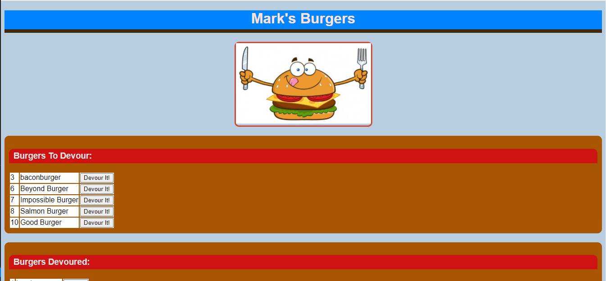

# Project-BurgerApp

## Link to the application deployed on Heroku

https://arcane-mountain-75010.herokuapp.com/

## Description 
A simple web application following the MVC paradigm (Model View Controller). This javascript application uses Node, Express, Handlebars, and SQL to display an interractive experience for the user. The user can manually enter a burger he or she would like to consume which then gets added to the database and displays on screen. Once the burger has been consumed the button can be clicked to have it added to the "Devoured" section. On the back-end the burger is updated in the database to reflect it has been consumed. If the user wishes he or she can then select the button to delete the burger from the database.

## Table of Contents 
* [Installation](#installation) 
* [Usage](#usage) 
* [License](#license) 
 
## Installation 
1. Open terminal.
2. Type the command 'npm i'.
3. Type the command 'node server.js'.
4. Navigate to the localhost 3000 in the browser to view the application.
 
## Usage 
1. There have been burgers pre-populated in the database displayed on screen.
2. Enter a burger in the input field below to get started and submit it.
3. The burger displays in the Burgers To Devour section.
4. Select Devour It! to add the burger to the Burgers Devoured section.
5. Select Delete to delete the burger from the database
 
## License 
There is not a license for this application. 
